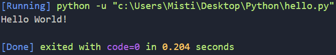

## Python이란

> 1991년 발표된 고급 언어로 플랫폼에 독립적이며 인터프리터, 객체지향적, 동적 타이핑 대화형 언어이다.

## 설치

- [https://www.python.org/downloads/](https://www.python.org/downloads/) 들어가서 최신버전을 다운로드 받으면 된다.

- cmd 창에서 python을 쳤을 때 아래 이미지와 같이 Python의 버전이 뜨면 잘 설치된 것이다.


## 기본 예제

- 가장 기본적인 `Hello World!`를 출력해보도록 하자.

```python
# hello.py
print("Hello World!")
```
